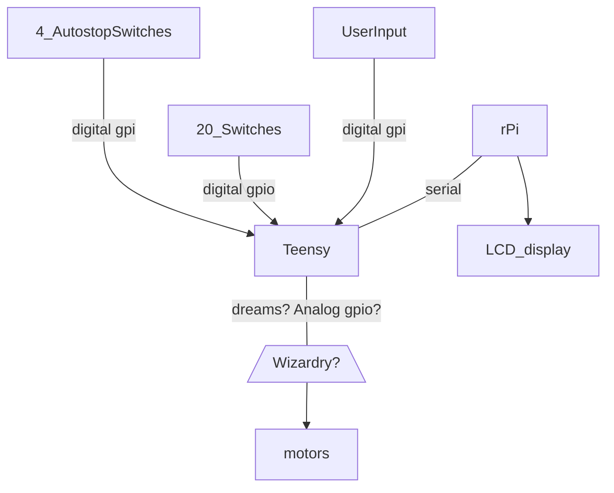

-* Steve suggests a 'no-modem' network via uart

* ?-Why a Teensy and an rPi?
* A-Teensy has 40 gpio pins and rPi has libraries for displaying visuals

# a Teensy Pinball Guide

### Upon aquiring your Teensy 4.1, follow these tutorials:
- https://www.pjrc.com/teensy/first_use.html
- https://www.pjrc.com/teensy/loader_win10.html
- https://www.pjrc.com/teensy/tutorial.html
- https://www.pjrc.com/teensy/tutorial3.html

### Files for the above tutorials can be found on the prjc site or in this repository 
